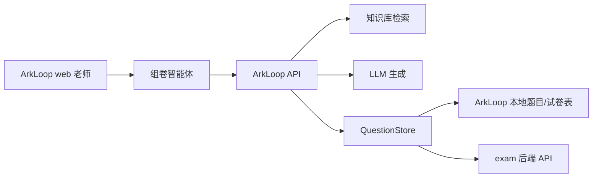

# Design: 老师端组卷智能体

> Status: ready-for-review
> Owner: jzefan
> Created: 2026-05-25
> Companion docs: [book-kb-rag PRD](../../prd/book-kb-rag.md), [Knowledge Scope Provider Proxy](./2026-05-24-exam-api-proxy-design.md)

## 背景

原 `book-kb-rag` PRD 描述的是一条完整链路：上传课程资料、建设知识库、基于知识库出题、组卷、沉淀到题库/试卷库。结合当前实现和产品体验，这条链路需要重新拆分职责：

1. 管理端负责复杂知识库建设。
2. 老师端 web 负责使用已建设好的知识库，完成问答、出题和组卷。

这个切分让老师端体验更聚焦。老师不需要知道资源来自 ArkLoop、exam 还是其他 provider；对老师来说就是在 ArkLoop 里完成组卷。exam 前端不改，ArkLoop 后端作为代理和编排层，在内部调用 exam 后端能力。

## 产品边界

### 管理端

`console-lite` 继续作为复杂知识库建设入口，面向管理员或教研人员：

- 创建和配置知识库；
- 上传并入库课程资料；
- 绑定课程范围或题库范围；
- 查看文档处理状态和入库错误；
- 通过搜索验证知识库质量；
- 重建、删除或维护知识库内容。

这些操作可以相对复杂，因为它们属于管理和教研准备工作。

### 老师端

`web` 不承载知识库建设流程。老师端只暴露一个围绕组卷的智能体入口，名称应偏向 **"组卷"** 或 **"智能组卷"**，不叫"备课助手"。

老师可以：

- 用自然语言提问；
- 基于课程资料生成题目草稿；
- 基于课程资料生成整张试卷草稿；
- 通过轻量表单调整生成要求；
- 预览、修改、重生成或拒绝草稿；
- 明确确认后保存题目和试卷。

老师端文案应使用"课程资料"、"知识库"、"题库"、"组卷题库"等 ArkLoop 语义，不暴露 exam 专有概念。

## 老师端体验

老师在 web 里打开"组卷"智能体后，直接通过对话表达需求。

示例：

> 基于七年级上册第一章生成一套 45 分钟测试卷，难度中等，包含选择题、填空题和应用题。

系统理解意图后，给出一个轻量表单面板，字段由对话自动推断：

- 知识库或课程资料范围；
- 知识点范围；
- 题型和数量；
- 难度分布；
- 总分和考试时长；
- 是否生成答案与解析；
- 当课程资料不足时，是否允许使用通用知识补充。

老师可以直接修改表单，也可以继续用自然语言调整，例如：

- "选择题少一点"；
- "加两道综合题"；
- "只基于第二节"；
- "不要用通用知识补充"。

智能体也支持纯问答。问答时系统先检索已选择或可推断的知识库；如果没有命中，再使用通用模型回答，但必须显式提示来源状态。

## 来源透明

智能体必须让老师清楚知道内容来源。

问答规则：

- 命中知识库时，标记为"基于课程资料回答"。
- 部分命中时，区分哪些内容来自课程资料，哪些是模型补充。
- 未命中知识库时，必须提示："未在当前课程资料中找到相关内容，以下为通用回答。"

生成规则：

- 基于课程资料生成的题目，应保留 source snippets 或 chunk references。
- 课程资料不足以支撑出题/组卷时，不能静默补齐。系统必须说明不足，并询问是否允许使用通用知识。
- 如果老师不允许使用通用知识，而资料不足，智能体应建议缩小范围、放宽约束，或由管理端补充资料后再生成。

这个规则避免老师误以为所有内容都来自已审核的课程资料。

## 草稿与保存

所有 AI 生成的题目和试卷，在老师确认前都只是草稿。

默认流程：

1. 老师提出需求。
2. 智能体检索知识库上下文和参考题。
3. 智能体展示或更新轻量表单。
4. 智能体生成题目或试卷草稿。
5. 老师预览、修改、重生成或拒绝草稿。
6. 老师明确确认保存。
7. ArkLoop 后端保存题目和试卷。

智能体不能自动保存 AI 生成内容。

## 组卷题库

通过 ArkLoop 生成的题目，统一保存到固定题库 **"组卷题库"**。

规则：

- "组卷题库"按 Account 维度存在。
- 保存时后端负责保证"组卷题库"存在；老师不需要手动选择或创建。
- 老师确认后，生成题目保存到"组卷题库"。
- 老师确认后，生成试卷也要保存。
- 题目记录创建老师。
- 试卷引用已保存的题目，便于后续复用、编辑和再次组卷。

老师端可以展示"保存到组卷题库"和"保存试卷"，但不暴露底层 provider。

## 后端架构

ArkLoop 继续作为编排层。

高层流程：

provider 细节留在 ArkLoop API 和 `QuestionStore` 实现后面。web 和 persona 优先使用 ArkLoop 领域语义。

后端需要提供的能力：

- 列出老师可用且 ready 的知识库；
- 检索知识库 chunks，并返回来源元数据；
- 生成题目草稿但不保存；
- 生成试卷草稿但不保存；
- 根据可用题池校验组卷缺口；
- 将确认后的题目保存到 Account 级"组卷题库"；
- 保存确认后的试卷及其题目引用；
- 当配置为 exam-backed store 时，由 ArkLoop 后端内部代理 exam API。

exam 前端不在本设计范围内。

## 智能体与工具方向

现有 `book-tutor-agent` 方向应改名或替换为更明确的组卷智能体。老师端产品概念是 **"组卷" / "智能组卷"**，问答只是辅助能力。

智能体包含两种模式：

1. 问答模式：优先基于知识库回答，未命中时显式提示后使用通用回答。
2. 组卷模式：把对话转成轻量表单，生成草稿，并在老师确认后保存。

worker tools 尽量保持 provider-neutral 命名：

- `kb_search`;
- `kb_list_knowledge_points`;
- `kb_draft_questions`;
- `kb_compose_paper`;
- `kb_save_questions`;
- `kb_save_paper`，或一个组合式 confirmed-save 操作。

草稿工具只能读取和生成，不落库。保存工具必须由 UI 或 agent state 提供明确的老师确认信号。

## 前端范围

老师端 `web` 改动应保持轻量：

- 增加或暴露"组卷"智能体入口；
- 支持对话界面；
- 支持智能体渲染轻量表单面板；
- 支持草稿预览和确认保存；
- 清晰展示来源状态提示。

`web` 不做文档上传、入库状态管理、知识库重建等复杂管理流程。

## 错误处理

老师端需要明确处理这些情况：

- 没有 ready 知识库：提示老师联系管理员或教研人员在管理端建设知识库。
- 问答未命中知识库：展示规定的通用回答提示。
- 生成时资料不足：询问是否允许通用知识补充，或建议缩小范围。
- 保存失败：保留草稿，展示哪些题目或试卷部分失败，并允许重试。
- provider 不可用：提示保存目标暂时不可用，不在老师端文案里暴露 exam。

## 测试

实现阶段应覆盖：

- KB-first 问答和显式通用 fallback 提示；
- 草稿生成不落库；
- 保存必须依赖老师确认；
- Account 级"组卷题库"的自动创建或查找；
- 题目和试卷都保存；
- 来源状态展示契约；
- provider-backed 保存失败时返回老师可理解的错误。

## 不在范围

- 修改 exam 前端。
- 把知识库建设流程搬进 `web`。
- 让老师手动选择任意 provider-specific 题库作为 AI 生成题的保存目标。
- 未经老师确认自动保存 AI 生成的题目或试卷。
- 把通用模型补充内容伪装成课程资料内容。
