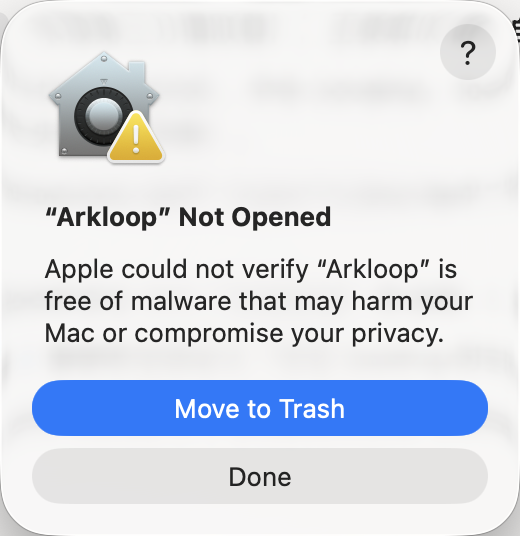
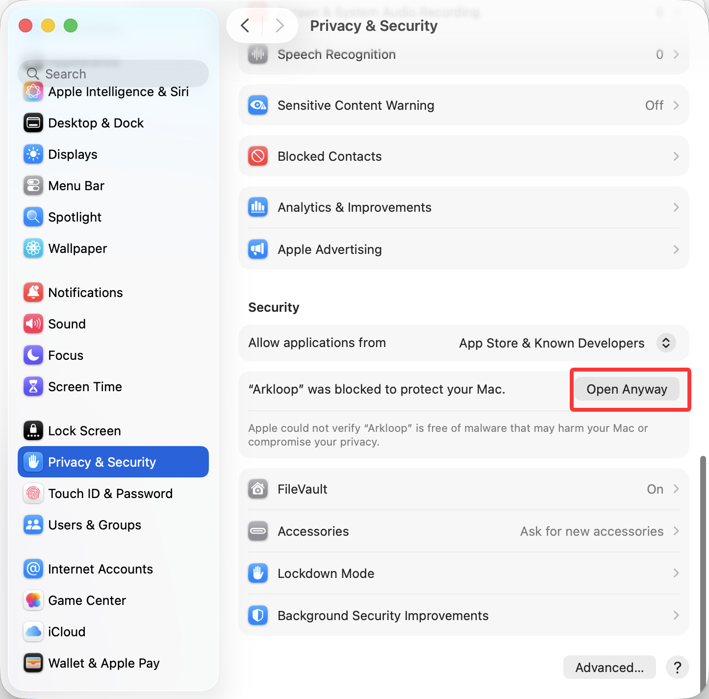
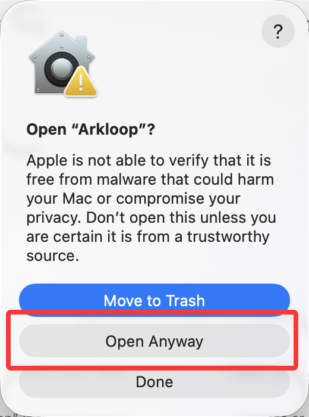

<p align="center">
  
</p>

<h3 align="center">开源/干净/强大，属于你的 AI Agent 平台</h3>

<p align="center">
  <a href="../../README.md"></a>
  <a href="../../LICENSE"></a>
  <a href="https://github.com/qqqqqf-q/Arkloop/graphs/commit-activity"></a>
  <a href="https://github.com/qqqqqf-q/Arkloop/issues"></a>
  <a href="https://x.com/intent/follow?screen_name=qqqqqf_"></a>
</p>

---

Arkloop 是一个注重设计的开源 AI 智能体平台。多模型路由、沙箱执行、持久记忆，一个干净的桌面应用，开箱即用

## 下载

从 [GitHub Releases](https://github.com/qqqqqf-q/Arkloop/releases) 下载最新版本，支持 macOS、Linux 和 Windows。

桌面应用内置完整运行环境 -- 无需 Docker，无需配置，打开即用。通过 GitHub Releases 自动更新。

<details>
<summary>macOS：打不开 / 提示无法验证（不要点「移到废纸篓」）</summary>

若出现 **Apple 无法验证 Arkloop**，不要选择 **移到废纸篓**（对应英文 **Move to Trash**）。

1. 点 **完成** 或关闭该对话框。

   

2. 打开 **系统设置 → 隐私与安全性**，在 **安全性** 区域找到与 Arkloop 相关的提示，点击 **仍要打开**（**Open Anyway**）。

   

3. 再次出现确认对话框时，再次选择 **仍要打开**。

   

</details>

## 贡献

我们欢迎所有形式的贡献。

即使你不是开发者，只是一个普通用户 -- 如果你在使用中感到任何不舒服的地方，哪怕只是一点间距、一个颜色、一个很小很小的细节，或者是一个很大很大的方向，都可以直接[开一个 issue](https://github.com/qqqqqf-q/Arkloop/issues)。我们认真对待每一个体验细节，你的反馈会让所有人的体验变得更好。

提交规范和开发流程参见 [CONTRIBUTING.md](../../CONTRIBUTING.md)。

## 如果可以的话，点个Star吧

## 功能概览

Arkloop 做的事情和你用过的其他 AI 对话工具类似 -- 多模型支持、工具调用、代码执行、记忆 -- 但我们关注的是把这些做得干净：

- **多模型路由** -- OpenAI、Anthropic 及任何兼容接口，基于优先级自动路由和限流处理
- **沙箱执行** -- Firecracker 微虚拟机或 Docker 容器中运行代码，严格资源限制
- **持久记忆** -- 系统约束、长期事实和会话上下文跨对话保留
- **Prompt 注入防护** -- 语义级扫描，检测并拦截注入攻击
- **渠道接入** -- Telegram 集成，支持媒体处理和群组上下文
- **自定义 Persona** -- 独立的系统提示词、工具集和行为配置，支持 Lua 脚本
- **MCP / ACP** -- Model Context Protocol 和 Agent Communication Protocol 支持
- **技能生态** -- 从 ClawHub 导入技能，兼容 OpenClaw SKILL.md 格式

完整文档参见 [docs](https://arkloop.io/zh/docs/guide)。

## 架构

| 服务 | 技术栈 | 职责 |
|------|--------|------|
| API | Go | 认证、RBAC、资源管理、审计日志 |
| Gateway | Go | 反向代理、速率限制、风控评分 |
| Worker | Go | 任务执行、LLM 路由、工具调度、Agent Loop |
| Sandbox | Go | 代码执行隔离 |
| Desktop | Electron + Go | 原生桌面应用，内嵌 Sidecar |
| Web | React / TypeScript | 用户界面 |
| Console | React / TypeScript | 管理仪表板 |

基础设施：PostgreSQL、Redis、SeaweedFS（或 filesystem）、OpenViking（向量记忆）。

## 开发

```bash
bin/ci-local quick        # 快速本地 CI
bin/ci-local integration  # Go 集成测试
bin/ci-local full          # 完整检查
```

## 自托管

> 自托管部署方案尚在开发中，虽包含在当前版本中但是不保证可用性。在 Alpha 版本中我们不做这一点。我们计划在桌面版稳定后提供完整的服务端部署支持。


## 贡献者

<a href="https://github.com/qqqqqf-q/Arkloop/graphs/contributors">
  
</a>

## 安全

报告安全漏洞请发送邮件至 qingf622@outlook.com，而非公开 Issue。详情见 [SECURITY.md](../../SECURITY.md)。

## 许可证

基于 [Arkloop License](../../LICENSE)（修改版 Apache License 2.0），附加条件：

- **多租户限制** -- 未经书面授权，不得使用源码运营多租户 SaaS
- **品牌保护** -- 不得移除或修改前端组件中的 LOGO 和版权信息
