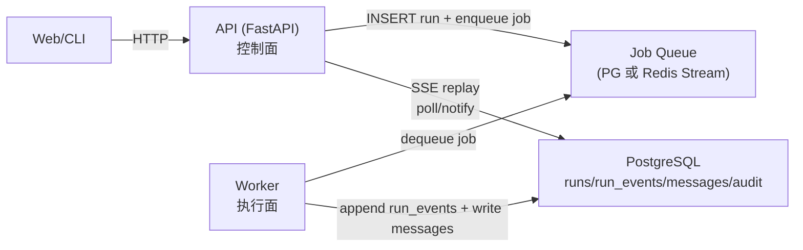

# Run 执行架构评审与拆分建议（API / Worker / Agent-Core）

本文面向你现在遇到的“api-worker-agent-core 粘在一起”的直觉问题：它在当前仓库确实存在（以 in-process stub 的形式存在），短期能跑通，但一旦你开始做真实 I/O 工具、并发与运维，就会立刻变成系统性瓶颈。

目标：
- 把现状讲清楚（具体到文件与依赖链），避免“感觉奇怪但说不出来”。
- 把风险讲清楚（性能、可靠性、运维、安全）。
- 给出一个**可按 Pxx 薄片落地**的迁移路线（优先不引入额外基础设施；必要时再引入 Redis/NATS 等）。

> 约束：本文不要求你立刻重写成微服务；先把“服务边界”兑现出来，再谈优化与重写（包括 Rust）。

---

## 1. 现状快照（以当前仓库代码为准）

### 1.1 实际运行拓扑（现在）

- API：FastAPI（`src/services/api/`）对外提供登录/threads/messages/runs/SSE。
- Run 执行：默认是 **Worker 进程内执行**（`ARKLOOP_RUN_EXECUTOR=worker` 或未设置时），API 只负责入库并投递 `run.execute` job。
- In-process（开发模式）：可设置 `ARKLOOP_RUN_EXECUTOR=in_process` 让 API 进程内执行（stub executor），用于本地演示与测试。
- Worker：消费 `jobs`，执行 `RunEngine.execute()` 并写入 `run_events`（SSE 仍从 DB 回放）。
- 事件源：`run_events` 表是 SSE 回放的唯一来源（`GET /v1/runs/{run_id}/events` 轮询 DB）。

### 1.2 “粘合点”在代码里的具体位置

1) API 进程内执行 Run（仅 in_process 模式，最核心的耦合点）
- `src/services/api/run_executor.py`
  - `QueuedRunExecutor`：往 `jobs` 表投递 `run.execute`（默认启用）。
  - `InProcessStubRunExecutor`：`asyncio.Queue` + 单一后台 task，拿到 `run_id` 后直接调用 `RunEngine.execute()`（仅开发/测试显式启用）。
  - `configure_run_executor()`：根据 `ARKLOOP_RUN_EXECUTOR` 选择 executor，并安装到 `app.state.run_executor`。

2) API 直接依赖 LLM Gateway 与 AgentLoop（仅 in_process 模式；worker 模式下 API 不应 import）
- `src/services/api/provider_routed_runner.py`
  - `ProviderRoutedAgentRunner` 内部创建 `AgentLoop(...)` 并驱动 `gateway.stream()`。
  - 同文件内直接构建 OpenAI/Anthropic Gateway（`OpenAiLlmGateway` / `AnthropicLlmGateway`），意味着 API 进程天然带着“执行面”的网络 I/O 代码与风险。

3) RunEngine 当前在 API 目录下（语义上像“执行面”）
- `src/services/api/run_engine.py`
  - 负责：拉取 run、检查取消、写 `run_events`、批量 commit、最终把 assistant 文本归并落 `messages`。

4) SSE 由 API 轮询 DB 回放（可用，但有规模上限）
- `src/services/api/v1.py`：`/v1/runs/{run_id}/events` 按 `poll_seconds` 轮询 `run_events`。
- `src/services/api/sse.py`：默认 `poll_seconds=0.25`，心跳 15 秒，batch_limit=500。

---

## 2. 如果继续“粘合”：会发生的真实问题（企业级视角）

这里不讲“架构洁癖”，只讲会导致你后面**加机器困难、检修困难、运维困难**的硬问题。

### 2.1 性能与扩缩容

- **API 进程同时承担控制面 + 执行面**：当 LLM 慢、工具慢、或出现重试/超时，API 的事件循环/线程池资源会被拖住，最终体现为：
  - HTTP 请求响应变慢（包括登录、SSE、管理端点）。
  - SSE 连接更容易被代理/负载均衡判定为不健康。
- **并发吞吐被“单消费者队列”限制**：`InProcessStubRunExecutor` 只有一个后台 `_run_loop()`，天然把 run 串行化（每个 API 进程一次处理一个 run）。
- **横向扩容不可控**：你无法独立扩容“run 执行能力”，只能扩容 API；这会把成本、故障域和发布节奏绑在一起。

### 2.2 可靠性（任务不丢、可重试、可恢复）

- **内存队列非持久**：API 进程重启/崩溃会直接丢失未执行的 run（数据库里只有 `run.started`，没有后续事件）。
- **缺少 ack / retry / backoff / DLQ**：企业系统里“偶发失败”是常态，没有可控的重试与失败隔离，运维会非常痛苦。
- **多进程/多实例行为不可审计**：一旦你用 `uvicorn --workers` 或 k8s 多副本，in-process executor 的行为变成“每个进程一套队列”，排障难度陡增。

### 2.3 运维与可观测性

- **故障域扩大**：执行面出问题会连带控制面；你无法只重启/滚动 worker 来恢复吞吐。
- **日志与指标混在一起**：虽然你已经有 `trace_id` 与 JSON 日志（做得对），但当两类职责混在一个进程里，后续做容量规划会更难。

### 2.4 安全边界与合规

- 当你进入 P55/P56（web_search/web_fetch）甚至更高风险工具（shell/code_execute）：
  - 如果仍然在 API 进程里执行，攻击面与数据泄露面会被放大。
  - “管理端点/鉴权逻辑”和“高风险工具执行”共进程，不符合多数企业安全审计习惯。

### 2.5 数据库压力（你迟早会遇到）

你当前的设计里，`run_events` 是唯一真相，这是正确的，但它带来天然的写放大：
- LLM 流式 chunk -> 多条 `message.delta` 插入。
- SSE 每个连接轮询 `list_events()`（默认 250ms）-> 大量小查询。

这些问题不是“现在就得解决”，但必须提前承认：当并发与事件量上来后，你需要：
- 更好的队列/并发隔离（先解决）。
- 更好的事件回放方式（后做：NOTIFY/缓存/聚合）。
- 更清晰的事件保留策略（归档/压缩/冷热分层）。

---

## 3. 你现在的设计里做对了什么（别推倒重来）

结合代码与 `development-roadmap.zh-CN.md` 的 1.5 节约定，你的方向是对的：

- **`run_events` 作为唯一真相**：推送、审计、回放统一一套事件模型，后续做企业审计会省很多返工。
- **SSE 以 `after_seq` 续传**：天然支持断线重连与回放验证（pytest 也能测）。
- **packages 与 services 分层**：`src/packages/*` 不依赖 `src/services/*`，这是一个很重要的“可拆分”前提。
- **trace_id 与日志脱敏**：`src/packages/observability/logging.py` 的规则化脱敏是企业级系统必须的底座。

结论：你不需要推翻；你需要把“边界”从文档落实到运行时拓扑。

---

## 4. 推荐的目标架构（最小可落地 + 可演进）

### 4.1 最小目标（对应 P54.5 的终态）

- API（控制面）
  - 负责：HTTP 端点、鉴权、审计写入、SSE 回放（从 `run_events` 读）。
  - 不负责：AgentLoop、LLM 调用、工具执行。
- Worker（执行面）
  - 负责：消费队列 job -> 运行 `RunEngine`（AgentLoop + ToolExecutor）-> 写 `run_events` 与最终 `messages`。
  - 可水平扩容：增加实例数即可提高吞吐。
- Agent-Core（纯逻辑）
  - 负责：循环与工具协议（不触网、不读写文件、不起进程）。

### 4.2 参考拓扑图（建议）

---

## 5. 队列选型：你提到的 Redis channel 是否合适？

先说结论：**Redis Pub/Sub channel 不适合作为“run 执行队列”**，但它可以作为“唤醒信号”。

### 5.1 Redis Pub/Sub 的问题

- 不持久：消费者不在线就丢消息。
- 无 ack/重试：你无法证明“任务没有丢”，更无法做 DLQ。
- 排障困难：企业系统里，队列必须可观测、可重放、可追责。

### 5.2 更合理的 v1（和你 roadmap 一致）：PostgreSQL 队列

你当前基础设施只有 PG（`compose.yaml` 也只起了 PG），因此 v1 推荐：

- **PG job 表 + `LISTEN/NOTIFY` 唤醒 + `SELECT ... FOR UPDATE SKIP LOCKED` 抢占**
  - 优点：不引入新依赖；持久；行为可解释；便于测试与回放。
  - 缺点：吞吐上限受 DB 影响；做极高吞吐需要更精细的索引/分区/归档策略。

### 5.3 需要 Redis 时，用 Redis Streams（不是 channel）

当你确实需要 Redis（缓存、限流、会话、队列统一）时：
- 用 **Redis Streams + Consumer Group** 做持久队列。
- 保持 job payload schema 版本化，保证未来可多语言 worker（包含 Rust）共存。

---

## 6. 迁移路线：按 Pxx 薄片落地（建议你下一步怎么做）

你已经完成 P53，接下来要写 P54 与 P54.5。我的建议是：按“先链路验证，再兑现边界”的顺序推进，但要把队列抽象提前占位，避免返工。

### 6.1 P54（echo / noop）应验证什么

目标不是“多几个工具”，而是验证这条链路在真实 tool_call 下稳定：

LLM tool_call -> policy -> executor -> tool.result -> tool role message -> 下一轮 -> run.completed

建议验收点：
- `tool.call` / `tool.result` 事件对齐（tool_call_id 能关联）。
- policy.denied 的行为可解释且可回放。

### 6.2 建议新增一个薄片：P54.2 JobQueue 抽象（先占位）

不要先讨论 Redis；先把“边界”写成接口，让后端可替换：
- `JobQueue.enqueue_run(...)`
- `JobQueue.lease(...) / ack(...) / nack(...)`（至少能重试与退避）

v1 实现用 PG；未来换 Redis Streams/NATS/Kafka 只替换实现，不改 API/Worker 业务逻辑。

### 6.3 建议新增一个薄片：P54.3 Worker 执行面 composition root

像 `src/services/api/main.py` 一样，为 worker 建一个清晰的 composition root：
- 组装 Database、ProviderRouter、GatewayFactory、ToolRegistry/Allowlist、ToolExecutor、RunEngine。
- 启动“消费 loop”（并发上限可配置）。

### 6.4 P54.5（兑现边界）：API 不再执行 AgentLoop

切换的判定标准要“可自动验证”，而不是靠约定：
- API 侧 `run_executor` 只能 enqueue；不再创建 `AgentLoop`、不再 import OpenAI/Anthropic gateway。
- Worker 侧真正执行 `RunEngine.execute()` 并写事件。
- SSE 仍只从 DB 回放（API 无需感知 worker 实例）。

建议保留 `InProcessStubRunExecutor`，但只能用于：
- 单机开发演示（显式开关）。
- 单元/集成测试（避免引入队列依赖）。

也就是说：**把默认值从“in-process”换成“queued”**，避免未来上线时踩坑。

---

## 7. “把 tools 拆成独立服务”该怎么判断（避免过早微服务化）

你的想法方向没错，但建议分级处理：

1) 低风险、纯函数、轻 I/O（echo/noop/web_search/web_fetch）
- 先在 worker 内执行，靠 allowlist + policy + 超时控制。

2) 高风险/强副作用（shell/code_execute/写文件/发网请求到内网）
- 不是“拆微服务”，而是先做**强隔离执行环境**：
  - 子进程 + 资源限制
  - 容器沙箱（gVisor/nsjail）或独立 sandbox worker

3) 资源型工具（OCR/PDF/向量化/大文件解析）
- 可以在未来拆成独立 tool worker 池（同一队列协议，不同 job_type），以便独立扩缩容。

核心原则：先把“控制面/执行面”分开，再谈“工具面”拆分；否则你会在分布式复杂度里迷路。

---

## 8. Rust 重写应放在什么位置（只给你一个方向）

Rust 重写不是救火，而是锦上添花；它应该发生在**边界明确之后**：
- 你先把 `JobQueue` 与 `run_events` 语义稳定下来。
- 然后你可以把某一类 worker（例如 tool worker 或 run worker）换成 Rust 实现，只要：
  - 消费同一套 job payload
  - 写同一套 `run_events`（保证 SSE 回放与审计一致）

这样 Rust 是“可替换实现”，不会把你再次锁死在某种进程形态里。

---

## 9. 最终结论（给你一句可执行的建议）

你现在感觉“粘合在一起很怪”是对的：它是一个合理的过渡实现，但绝不能作为企业级运行形态保留到 P55/P56 之后。

下一步建议优先级：
1) 按 P54 做 echo/noop，把 tool_call 全链路打稳。
2) 立刻进入 P54.5（中间加一个 JobQueue 抽象薄片），把 RunEngine 与 provider gateway 全部挪到 Worker，API 只做编排与回放。
3) P55/P56 的真实 I/O 工具只在 Worker 里落地，API 进程保持“干净可水平扩容”。
